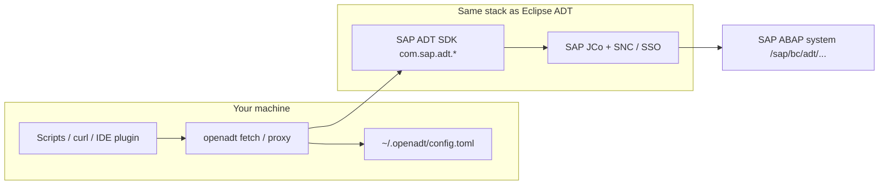

<div align="center">


# OpenADT

**Run SAP ABAP Development Tools (ADT) from the terminal — with the same SDK and logon stack as Eclipse.**

[](https://github.com/abapify/openadt/releases)
[](LICENSE)
[](https://github.com/abapify/openadt/actions/workflows/ci.yml)
[](#install)
[](apps/ARCHITECTURE.md)

[Quick start](#quick-start) · [Install](#install) · [Usage guide](docs/usage.md) · [Specs](specs/) · [Report issue](https://github.com/abapify/openadt/issues)

</div>

---

## Why OpenADT exists

SAP ships ADT as **Eclipse plugins** on top of **JCo destinations** and corporate SSO (SNC, Secure Login, tickets). That stack works in the IDE, but it is awkward for everything else:

| You want to…                                        | Without OpenADT                                                     | With OpenADT                                                                |
| --------------------------------------------------- | ------------------------------------------------------------------- | --------------------------------------------------------------------------- |
| Hit `/sap/bc/adt/...` from a script or CI job       | Reimplement auth, cookies, CSRF, SNC — or copy fragile curl recipes | `openadt fetch DEV /sap/bc/adt/discovery`                                   |
| Point a local tool at SAP (extension, test harness) | Teach it SAP logon protocols                                        | `openadt proxy DEV --listen 127.0.0.1:8080` and use plain HTTP to localhost |
| Let an AI agent read ADT APIs safely                | Give the model raw landscape credentials or custom HTTP hacks       | MCP bridge over `fetch` ([preview](#mcp-preview))                           |

**OpenADT is not another ADT HTTP client.** It is a thin **Java wrapper around the official `com.sap.adt.*` SDK** so `fetch` and `proxy` behave like Eclipse ADT when `runtime.adt_plugins_dir` is configured — including destination selection and SNC SSO where your machine already has JCo and crypto libraries.

OpenADT does **not** bundle SAP software. You install licensed JCo, ADT plugins, and landscape config from SAP or your organization; OpenADT detects and wires them once via `openadt config bootstrap`.

---

## How it fits in your stack



- **`openadt fetch`** — one ADT request from the terminal (JSON-friendly output for automation).
- **`openadt proxy`** — localhost HTTP reverse bridge; callers speak HTTP to `127.0.0.1`, OpenADT speaks ADT to SAP.
- **`openadt config bootstrap`** — detect systems and runtime paths, write config (no rescan on every request).

---

## Quick start

After [install](#install), on a machine that already has SAP ADT/Eclipse or staged JCo (see [usage guide](docs/usage.md)):

```bash
openadt config bootstrap    # detect landscape → ~/.openadt/config.toml
openadt proxy DEV --listen 127.0.0.1:8080
openadt fetch DEV /sap/bc/adt/discovery --pretty
```

Use fictional aliases in docs and tests (`DEV`, `DEVELOPER`, `dev-ms.example.com`). Your real `~/.openadt/config.toml` stays local and is not part of this repo.

---

## Install

<table>
<tr>
<th>Windows (Scoop)</th>
<th>Linux / macOS (Homebrew)</th>
</tr>
<tr>
<td>

```powershell
scoop bucket add openadt https://github.com/abapify/scoop-bucket
scoop install openadt
```

One-shot (no bucket):

```powershell
scoop install https://raw.githubusercontent.com/abapify/openadt/main/packaging/scoop/openadt.json
```

</td>
<td>

```bash
brew tap abapify/openadt
brew install openadt
brew update && brew upgrade openadt   # later
```

</td>
</tr>
</table>

Build from source or corporate mirrors: [docs/usage.md#install-openadt-today](docs/usage.md#install-openadt-today) · [specs/packaging.md](specs/packaging.md).

---

## Commands at a glance

| Command                               | Purpose                                                                      |
| ------------------------------------- | ---------------------------------------------------------------------------- |
| `openadt fetch`                       | Single ADT HTTP call through the SDK (or explicit fallback transport)        |
| `openadt proxy`                       | Localhost bridge for tools that only speak HTTP                              |
| `openadt config` / `config bootstrap` | Show or generate merged TOML config                                          |
| `openadt setup`                       | Legacy entry point; prefer `config bootstrap` + [setup spec](specs/setup.md) |

Full CLI contract: [specs/cli.md](specs/cli.md).

---

## Transport modes

Default is **SDK** (Eclipse-parity). Fallbacks are opt-in:

| `adt.transport`     | When to use                                                             |
| ------------------- | ----------------------------------------------------------------------- |
| `sdk` (**default**) | `runtime.adt_plugins_dir` set — preferred                               |
| `http`              | Explicit opt-in; browser SSO / `MYSAPSSO2` ticket HTTP without full SDK |
| `rest-rfc`          | JCo present but no ADT plugin pool                                      |

Details: [specs/cli.md](specs/cli.md) · [specs/config.md](specs/config.md).

---

## MCP preview

Experimental **stdio MCP** so agents (Cursor, Claude, Copilot, etc.) can call ADT via `adt_fetch` / `adt_discover` without reimplementing SAP logon.

- Spec: [specs/mcp.md](specs/mcp.md)
- Bridge: [tools/mcp-bridge/](tools/mcp-bridge/)

---

## What OpenADT is not

- A replacement for Eclipse ADT or SAP GUI
- A landscape scanner on every request (bootstrap writes config once)
- A redistribution of SAP JCo, ADT plugins, or Secure Login — **you** supply licensed installs

Product vision and package map: [specs/vision.md](specs/vision.md) · [apps/ARCHITECTURE.md](apps/ARCHITECTURE.md).

---

## Documentation

| Topic                                       | Link                           |
| ------------------------------------------- | ------------------------------ |
| Install, WSL, devcontainer, troubleshooting | [docs/usage.md](docs/usage.md) |
| Behavior specs                              | [specs/](specs/)               |
| Contributing / agents                       | [AGENTS.md](AGENTS.md)         |
| Security                                    | [SECURITY.md](SECURITY.md)     |

---

## License

[Apache License 2.0](LICENSE) — Copyright contributors. SAP, ABAP, and ADT are trademarks of their respective owners; this project is not affiliated with SAP SE.
